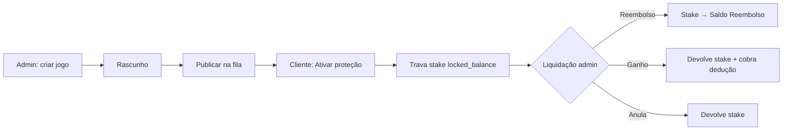
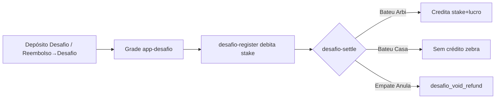

# Funcionamento — Desafio, Jogos Protegidos, Financeiro e Admin

**Público:** operação, suporte e desenvolvimento  
**Data-base do código:** `main` (Agosto/2026)  
**Produtos cobertos:** Jogos Protegidos (`stake_lock_v1`) · Desafio ArbiShield  
**Contratos travados:** `protection-flow-contract-v13` · `system-non-regression-v1`

> Ao descrever **proteção**, citar **somente** `stake_lock_v1` / contrato v10.  
> Detalhe normativo da proteção: [`PROTECTION_FLOW_LOCKED.md`](./PROTECTION_FLOW_LOCKED.md).  
> Anti-regressão do sistema: [`SYSTEM_NON_REGRESSION.md`](./SYSTEM_NON_REGRESSION.md).  
> Publicação: [`RELEASES.md`](./RELEASES.md).

---

## 1. Visão geral dos dois produtos

| | **Jogos Protegidos** | **Desafio** |
|---|---|---|
| Objetivo | Cobrir aposta na exchange (LAY/BACK) | Ciclo de entradas na zebra ArbiShield × casa externa |
| Carteira de entrada | Saldo Apostador (`balance_cents`) — stake é **travado** | Carteira Desafio (`desafio_balance_cents`) — stake é **debitado** |
| Grade do cliente | `app-proteger.html` | `app-desafio.html` |
| Admin principal | `admin-jogos.html` + monitor proteções | `admin-desafios.html` + `admin-monitoring-desafios.html` |
| Liquidação | REEMBOLSO / GANHO / ANULA | Bateu Arbi / Bateu Casa / Empate Anula |
| Modelo | `stake_lock_v1` | Ciclo zebra (`desafio-ciclo-sinais-v1`) |

São produtos **independentes** (carteiras e APIs distintas), mas compartilham o extrato financeiro e o painel admin.

---

## 2. Jogos Protegidos (`stake_lock_v1`)

### 2.1 O que o cliente faz

1. Abre **Proteger Aposta** (`app-proteger.html`).
2. Escolhe um jogo **publicado** e ainda **antes do kickoff**.
3. Informa odd e valor (LAY = responsabilidade · BACK = stake).
4. Sistema valida teto e liquidez → **Ativar proteção**.
5. Acompanha em **Minhas Proteções** (`app-protecoes.html`).

### 2.2 Regras de ativação

| Regra | Comportamento |
|---|---|
| Trava de stake | **Não trava** (v12) — só registra valor da entrada BetBra |
| Teto 50% | Máx. **50% do Saldo Apostador restante** naquele momento (sucessivo por evento) |
| 1 op / evento | Uma proteção ativa por `user` + `match` (cancelada não conta) |
| Pré-kickoff | Recusa se `now >= starts_at` |
| LAY / BACK | LAY = responsabilidade · BACK = stake |

### 2.3 Formas de ganho / resultado (proteção)

Vocabulário da UI: **Reembolso** · **Ganho** · **Anula**.

| Resultado (admin/UI) | Significado | Locked stake | Dinheiro |
|---|---|---|---|
| **Reembolso** (indicação falhou) | Cliente perdeu na BetBra | — | Stake **integral** → **Saldo Reembolso** |
| **Ganho** (indicação bateu) | Cliente ganhou na BetBra | — | **Sem movimento**; split 1% da entrada / 2,5% do bruto / resto ArbiShield |
| **Anula** (Empate Anula / void) | Empate ou void | — | Sem P&L (nem usuário nem empresa) |
| **Cancelar** | Admin ou contestação | — | Sem movimento |

**Entrada (v13):** não trava stake. **Economia no GANHO:** BACK = `stake×(odd−1)` · LAY = `liability/(odd−1)`.  
Cliente **1% da stake/responsabilidade** · BetBra **2,5% do lucro bruto** · ArbiShield = bruto − cliente − taxa — sem débito no Apostador.

### 2.4 Arquivos-chave (proteção)

| Camada | Arquivo |
|---|---|
| Contrato | `scripts/lib/protection-flow-contract.mjs` |
| Create / settle cliente | `scripts/arbishield-prelive-events.mjs` · `src/lib/arbishield/create-protection.ts` |
| Settle / cancel admin | `scripts/arbishield-serverfn-shim.mjs` |
| UI cliente | `app-proteger.html` · `app-protecoes.html` |
| UI admin jogos | `admin-jogos.html` |
| Extrato | `v2-financeiro.js` |

---

## 3. Desafio ArbiShield

### 3.1 O que o cliente faz

1. Deposita na **Carteira Desafio** (PIX `dest=desafio` ou transferência **Saldo Reembolso → Desafio**).  
   Banca (Apostador) → Desafio está **bloqueada**.
2. Abre `app-desafio.html` — grade só libera com `desafio_balance_cents > 0`.
3. Em cada card vê dois painéis (ArbiShield × casa), odd, liquidez, valor sugerido na casa.
4. Confirma stake → **Apostar na ArbiShield** → `POST /api/arbishield/desafio-register`.
5. Segue a jornada em `app-desafio-jornada.html`.

### 3.2 Regras de entrada

- Debita o stake de `desafio_balance_cents` (sem linha `desafio_entry` no ledger — PATCH direto).
- Lado na plataforma: **`arbishield`** (zebra). Na casa externa o cliente usa o valor sugerido / link.
- Máx. **5** entradas no ciclo; **1** participação pendente por vez; **1** registro por user+step+side.
- Entrada só **antes do kickoff** (etapa `live` / `done` bloqueia).
- Lucro alvo padrão do ciclo ~**5%**; comissão casa default **4,5%** no step.

### 3.3 Formas de ganho / resultado (Desafio)

Liquidação admin por etapa: **Bateu ArbiShield** · **Bateu Casa** · **Empate Anula**.

| Botão admin | `winningSide` / step.result | Cliente na zebra | Dinheiro na Carteira Desafio |
|---|---|---|---|
| **Bateu ArbiShield** | `arbishield` → `zebra_protected` | `won` | Credita **stake + lucro** (reutilizável). Pode avançar ciclo / forfeit a provedores em alguns circuitos |
| **Bateu Casa** | `casa` → `win` | `lost` | Sem crédito — stake fica com a plataforma. Lado casa (se houver) recebe **só o lucro** |
| **Empate Anula** | `void` / `empate_anula` | `void` | Devolve stake · tx `desafio_void_refund` |

**Marcador de mercado (`desafio-dnb-flag-v1`):** Empate Anula/DNB é aposta **no time** (V no vencedor, × no outro, **E** se empatar) — não resolver pelo ramo 1X2 `isDraw`.

**Layout do card (`desafio-painel-lado-time-v1`):** quadro fica sob o time apostado; casa sempre com logo (`desafio-casa-logo-v1`).

### 3.4 Cancelamento e exclusão

| Situação | Quem / o quê |
|---|---|
| Etapa **ao vivo** | Só **liquidar** — cancelar/excluir → **403** (`block-cancel-delete-andamento-v1`) |
| Publicado/agendado (não ao vivo) | **Isaac/Carlos** podem cancelar desafio e devolver entradas pendentes (`protect-ops-isaac-carlos-v1`) |
| Cancel participação pendente | Estorno `desafio_cancel_refund` na Carteira Desafio |
| Excluir | Soft-delete; não apaga ativo/publicado sem force; exige confirm |

### 3.5 Arquivos-chave (Desafio)

| Camada | Arquivo |
|---|---|
| UI cliente | `app-desafio.html` · `app-desafio-jornada.html` · `desafio-ciclo-math.js` |
| UI admin | `admin-desafios.html` · `admin-monitoring-desafios.html` |
| Backend | `scripts/arbishield-serverfn-shim.mjs` |
| Math ciclo | `src/lib/arbishield/desafio-ciclo-math.ts` |
| Testes | `desafio-market-flag.test.mjs` · `desafio-ops-guard.test.mjs` · `desafio-edit-preserva.test.mjs` |

Tabelas: `desafios` · `desafio_steps` · `desafio_participations`.

---

## 4. Área financeira (visual)

### 4.1 Páginas

| Página | Path | Função |
|---|---|---|
| Carteira | `app-carteira.html` | Cards de saldo, transferências, saque Reembolso, extrato |
| Financeiro (JS) | `v2-financeiro.js` | Labels, períodos, extrato detalhado de eventos |
| Shell | `v2-shell.js` | Chip de saldos na nav (incl. Desafio) |

### 4.2 Buckets (label na UI ↔ coluna)

| Label na UI | Coluna `profiles` | Uso |
|---|---|---|
| Saldo Real / Apostador | `balance_cents` | Entrada de proteção (trava) |
| Saldo Reembolso | `deduction_balance_cents` | Crédito quando ArbiShield cobre; sacável / transferível ao Desafio |
| Saldo Travado | `locked_balance_cents` | Stake de proteção ativa |
| Carteira Desafio | `desafio_balance_cents` | Entradas do Desafio |
| Saldo Provedor | `investor_balance_cents` | Aportes provedor |
| Demo | `demo_balance_cents` | Conta demo |

**Nunca** exibir “Saldo Dedução” — o nome oficial é **Saldo Reembolso**.

### 4.3 Tipos de lançamento no extrato

**Proteção**

| Tipo | Significado na UI |
|---|---|
| `protection_lock` | Entrada (trava stake) |
| `protection_settlement` | Saída do evento (ex.: crédito Reembolso) |
| `protection_fee` / `exchange_commission` | Dedução |
| `protection_refund` / `protection_unlock` / `protection_release` | Estorno / liberação |

**Desafio**

| Tipo | Significado na UI |
|---|---|
| `desafio_deposit` | Depósito / crédito manual no Desafio |
| `desafio_cancel_refund` | Estorno (cancelado pelo admin) |
| `desafio_void_refund` | Estorno Empate Anula |
| `desafio_forfeit_to_provider` | Forfeit → Provedor |
| `desafio_zebra_payout` | Label de lucro zebra (settle costuma creditar saldo **via PATCH**, sem sempre gravar este tipo) |
| `desafio_reregister` | Label de reentrada (uso operacional / scripts) |

**Admin / caixa**

| Tipo | Significado |
|---|---|
| `admin_adjustment_credit` (e afins) | Ajuste manual em `admin-users` |
| `provider_deposit` | Crédito Provedor (depósito manual aprovado) |
| `manual_deposit` / aprovação | Via `admin-manual-deposits` → gera `desafio_deposit` / `provider_deposit` / crédito Apostador |

### 4.4 Movimentações permitidas entre buckets

| De → Para | Permitido? |
|---|---|
| Saldo Reembolso → Carteira Desafio | Sim (`POST /api/arbishield/transfer-desafio`) |
| Banca (Apostador) → Desafio | **Não** (403) |
| Saldo Reembolso → saque PIX | Sim (`deduction-withdraw` / RPC `request_saldo_reembolso_withdrawal`) |

---

## 5. Admin — visão por tela

### 5.1 Lançar jogos protegidos — `admin-jogos.html`

1. **Importar BetBra** (`GET /api/arbishield/prelive-events`) **ou** preencher **evento manual**.
2. Buscar times/logos: `GET /api/arbishield/football-teams?q=`.
3. `POST /api/arbishield/matches` → cria em **rascunho** (`is_published=false`).
4. **Publicar na fila** → `is_published=true` → aparece em Proteger Aposta.
5. Durante o jogo: sync de placar (`match-live-sync` quando aplicável).
6. **Liquidar:** placar + **REEMBOLSO / GANHO / ANULA** → `POST /api/arbishield/match-settle`.
7. Finalizado: tira da grade (`is_published=false`).

Editar jogo publicado **não** deve despublicar sem ação explícita (mesma ideia do Desafio).

### 5.2 Lançar / operar Desafio — `admin-desafios.html`

1. Criar desafio + etapas (odd Arbi, odd casa, liquidez, horários).
2. **Publicar** (ou “Publicar ao salvar”).
3. **Editar** desafio já no ar: modo `edit_only` — **preserva** `is_active` / `published_at` (`admin-desafios-edit-preserva-publicacao-v1`).
4. Liquidar etapa: Bateu Arbi / Casa / Empate Anula → `desafio-settle`.
5. Cancelar / excluir: regras da §3.4.

### 5.3 Monitor de Desafios — `admin-monitoring-desafios.html`

- Layout em **cards** (não tabela densa): zonas `mdz-card-top` / `mdz-card-game` / `mdz-card-foot`.
- Settle rápido: Bateu Arbi / Bateu Casa / Empate Anula.

### 5.4 Monitor de Proteções — `admin-monitoring-protections.html`

- **Encerrar (sem estorno)** → `protection-close`.
- **Cancelar** (devolve stake) → `protection-cancel`.

### 5.5 Lançar saldo — `admin-manual-deposits.html`

- **Confirmar e Creditar** — aprova e credita o bucket (Apostador / Desafio / Provedor).
- **Já creditado** — marca sem alterar saldo.
- API: `approveManualDeposit` + perfil financeiro admin.

### 5.6 Usuários e extrato

| Tela | Uso |
|---|---|
| `admin-users.html` | Ajuste de saldo (`adjust-balance`), buckets, **Espelho de conta**, drawer de extrato |
| `admin-transactions.html` | Ledger `wallet_transactions` (limit alto), filtros e labels PT |

### 5.7 Sessão admin

- Allowlist de e-mail (`ALLOWED_ADMIN_EMAILS`) + MFA — role no banco **não basta**.
- **Modo usuário** / **Modo ADM** (`v2ModeSwitch`).
- **Espelho:** `setImpersonation` / banner «Sair do espelho»; Proteger fica readonly no espelho.

---

## 6. APIs usadas (mapa)

Serviços em produção:

- **Prelive / matches** — tipicamente `:3098` (`arbishield-prelive-events.mjs`)
- **Shim / Desafio / admin finance** — tipicamente `:3101` (`arbishield-serverfn-shim.mjs`)
- Health deve expor `protectionRuntime=protection-runtime-stake-lock-v13` e `createProtectionModel=stake_lock_v1`

### 6.1 Jogos protegidos e grade

| Método | Rota | Função |
|---|---|---|
| GET | `/api/arbishield/matches` · `/available-matches` · `/matches/available` | Grade / lista |
| POST | `/api/arbishield/matches` | Criar jogo (manual/BetBra) ou settle (`mode: settle`) |
| GET | `/api/arbishield/football-teams` | Busca times/logos |
| GET | `/api/arbishield/prelive-events` | Radar BetBra (admin) |
| POST | `/api/arbishield/match-settle` | Liquidar partida + proteções |
| POST | `/api/arbishield/match-live-sync` | Placar ao vivo |
| POST | `/api/arbishield/protections` | Criar proteção · contestações · `contest_cancel_auto` |
| POST | `/api/arbishield/create-protection` | Alias de create |
| POST | `/api/arbishield/protection-close` | Encerrar sem estorno |
| POST | `/api/arbishield/protection-cancel` | Cancelar + devolver stake |

### 6.2 Desafio

| Método | Rota | Função |
|---|---|---|
| GET/POST | `/api/arbishield/desafios` | Listar · criar · publicar · editar (`edit_only`) |
| POST | `/api/arbishield/desafio-register` | Entrada do cliente |
| POST | `/api/arbishield/desafio-settle` | Liquidar etapa |
| POST | `/api/arbishield/desafio-cancel` | Cancelar desafio inteiro ou participação |
| POST | `/api/arbishield/desafio-delete` | Soft-delete |
| POST | `/api/arbishield/desafio-restore` | Restaurar |
| POST | `/api/arbishield/desafio-participations` | Admin: lista da etapa |
| POST | `/api/arbishield/desafio-pending-counts` | Contagens pendentes |
| GET/POST | `/api/arbishield/desafio-history` | Histórico do cliente |
| POST | `/api/arbishield/desafio-jornada` · `desafio-journey` | Estado da jornada |
| POST | `/api/arbishield/desafio-sinal` · `desafio-sinal-preview` | Preview stakes/odds |
| POST | `/api/arbishield/transfer-desafio` | Reembolso → Desafio |

### 6.3 Financeiro / admin

| Método | Rota / ação | Função |
|---|---|---|
| POST | `/api/arbishield/adjust-balance` · `admin-adjust-balance` | Ajuste de saldo |
| POST | `/api/arbishield/deduction-withdraw` | Saque Saldo Reembolso |
| POST | `deposit-proof` / `approveManualDeposit` | Depósito manual |
| GET | `/health` | Runtime proteção + release |

---

## 7. Fluxos resumidos (mermaid)

### 7.1 Proteção — do lançamento ao settle

### 7.2 Desafio — da entrada à liquidação

---

## 8. Checklist operacional rápido

**Publicar jogo protegido**

1. `admin-jogos` → criar (BetBra ou manual) → **Publicar na fila**  
2. Conferir em `app-proteger` (antes do kickoff)  
3. Após o jogo → placar + REEMBOLSO/GANHO/ANULA  

**Publicar Desafio**

1. `admin-desafios` → criar etapas → **Publicar**  
2. Conferir saldo Desafio do cliente e card em `app-desafio`  
3. Ao vivo → **só liquidar** (nunca cancelar)  
4. Empate Anula / DNB → botão **Empate Anula** (não inventar resultado 1X2)

**Conferir dinheiro**

1. Cliente: `app-carteira` + extrato (`v2-financeiro`)  
2. Admin: `admin-users` (drawer) ou `admin-transactions`  
3. Lançamento manual: `admin-manual-deposits` (Confirmar e Creditar)

**Saúde da API**

- `/health` com `createProtectionModel=stake_lock_v1` e runtime v13  
- Pós-deploy: `scripts/vps-check-pos-deploy-v10.sh`  
- Auditoria superfície: `npm run audit:prod`

---

## 9. Referências e contratos

| Doc / contrato | Path |
|---|---|
| Fluxo proteção travado | `docs/PROTECTION_FLOW_LOCKED.md` |
| Não-regressão sistema | `docs/SYSTEM_NON_REGRESSION.md` |
| Releases frontend/shim | `docs/RELEASES.md` |
| Contrato proteção (código) | `scripts/lib/protection-flow-contract.mjs` |
| Buckets carteira | `scripts/lib/wallet-buckets-contract.mjs` |
| Ops admin | `scripts/lib/admin-ops-contract.mjs` |
| Espelho AGENTS | `AGENTS.md` (blocos protection-flow-lock + system-non-regression) |

**Alterar** regras de proteção, buckets, layout admin crítico ou fluxo Desafio andamento exige **pedido explícito** do dono + bump de versão + sync docs/testes.
